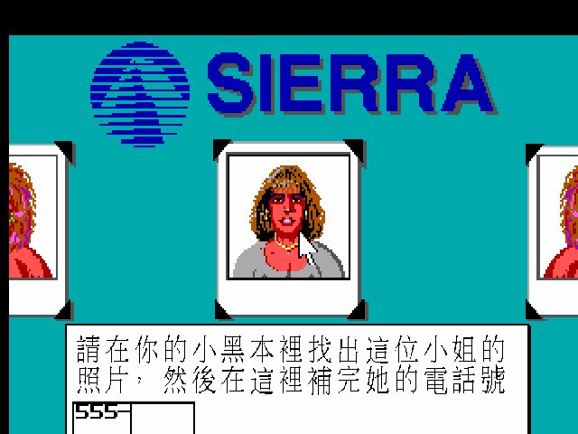
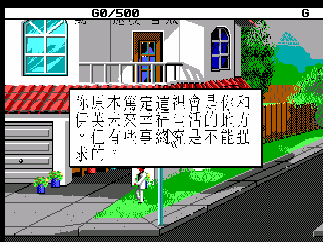
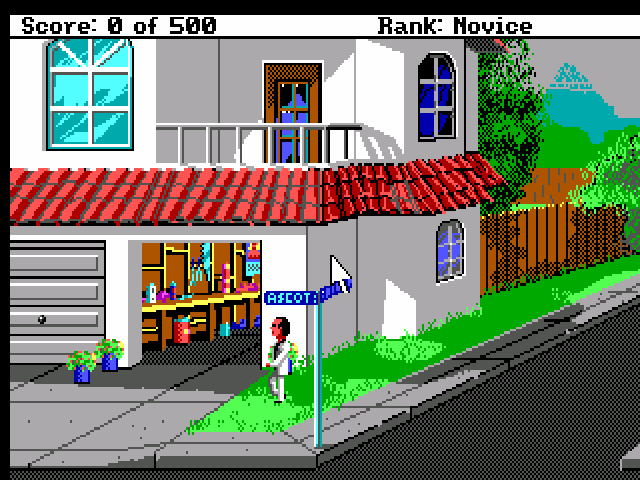
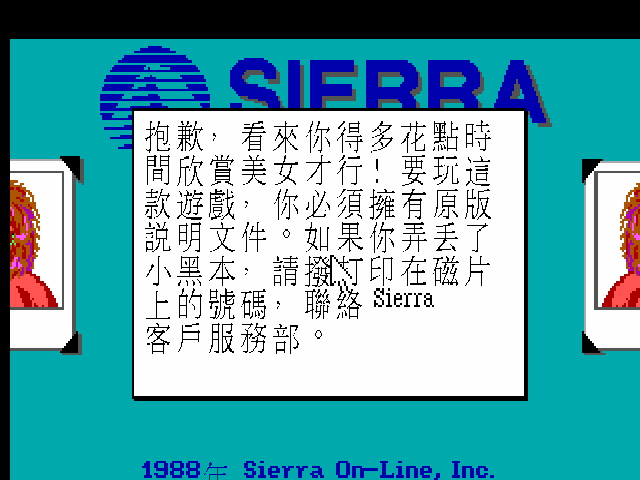
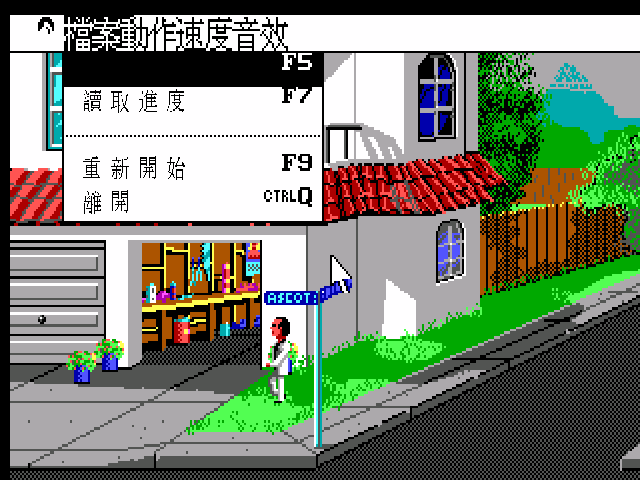
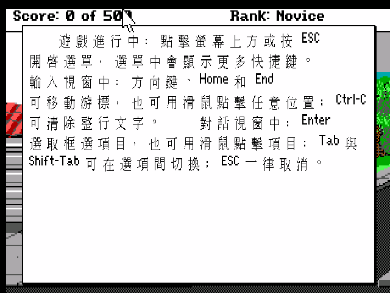

# 幻想空間 II — 繁體中文化

《Leisure Suit Larry 2: Goes Looking for Love (in Several Wrong Places)》（1988，Sierra On-Line）的繁體中文化，跑在 ScummVM 上，patch-only 散布。

原作是 Al Lowe 打造的成人喜劇冒險，主角賴瑞·拉夫（Larry Laffer）陰錯陽差捲進微縮膠片、KGB 探員、跨國郵輪與火山島的荒謬追逐。本專案把當年的 EGA 版本完整台式在地化——旁白、對白、道具、死法、雙關與葷段子照譯，並保留原味幽默。

> 引擎軌：SCI0 EGA（ScummVM 偵測 ID `sci:lsl2`）。中文以 `--language=tw` 啟用，走 640×400 hi-res 上採樣路徑，Big5 32px 字模銳利呈現。

## 畫面

| 版權保護（中文提示） | 開場旁白 |
|---|---|
|  |  |

| 街景（狀態列） | 版權保護失敗訊息 |
|---|---|
|  |  |

| 中文選單（檔案/動作/速度/音效） | F1 內建操作說明（中文） |
|---|---|
|  |  |

## 中文化範圍

- **對白／旁白／描述**：2,362 / 2,379 則（99%）。未譯的 17 則為刻意保留——組合語言謎題（「神聖 PC」關卡）、假西班牙文亂碼笑點、系統/檔名/debug 代碼。
- **台式在地化**：延續前作風格，雙關無法直譯時換成中文等效笑點；成人喜劇葷段子照譯不自我審查。
- **版權保護畫面**：提示與失敗訊息皆中文化。
- **音樂**：內建 Roland MT-32 模擬（Munt），音色遠勝 AdLib。完整版附 MT-32 ROM；patch 版玩家自備。
- **中文選單**：檔案 / 動作 / 速度 / 音效與下拉項（儲存進度、讀取進度、離開…）全中文。ZH_TWN 選單列加高以容納中文字並消除殘影。
- **內建操作說明**：按 **F1** 叫出中文操作說明——打字式冒險新手必看。
- **狀態列**：分數列（Score / Rank）保持英文（走 SCI font 0 路徑，Big5 在此不適用，英文較乾淨）。

## 下載與執行

到 [Releases](../../releases) 下載對應平台的 **patch 版**。patch 版只含引擎與中文資料，**不含遊戲**，需自備 LSL2 EGA 原版遊戲檔。

### Linux（AppImage）

```bash
chmod +x LSL2-CHT-patch-x86_64.AppImage
./LSL2-CHT-patch-x86_64.AppImage --path=/你的/LSL2遊戲夾 --auto-detect
```

或直接執行開啟 ScummVM 介面、手動加入你的遊戲夾（中文資料已內建，會自動套用）。

### 遊戲檔哪裡來

你需要合法持有的 LSL2 EGA 版遊戲檔（`RESOURCE.001`~`RESOURCE.006` + `RESOURCE.MAP`）。可於 GOG / Steam 購買（LSL 合輯內含）。

## 版權保護（電話號碼問答）

原版開場會顯示一位女子的照片，要你從手冊的「小黑本」（電話簿）找出她的電話號碼填入，答錯兩次即結束遊戲。

**繁中版預設略過此關**（輸入任意四碼皆過關）——原版這道關卡對重玩者不友善，且電話簿在當年的手冊裡。中文提示畫面仍會顯示，只是不再擋你。

想體驗原汁原味、自己對照手冊電話簿作答？跑英文版即可（不帶 `--language=tw`），或參考 `docs/manual-cht.md`。

## 中文手冊

當年軟體世界代理的中文手冊《珍004-幻想空間Ⅱ》要點索引整理於 [`docs/manual-cht.md`](docs/manual-cht.md)，含操作說明、電話簿與劇情背景。

## 技術與建置

- 引擎改動見 `patches/`（SCI ZH_TWN 啟用、Big5 繪字、hi-res 640×400 live 文字、版權保護 bypass hook）；建置流程見 `BUILD.md`。
- 中文對照表 `dist-cht/translation.tsv`（英文原文 → Big5 譯文，內容比對替換）。
- 上游 ScummVM pinned commit 見 `patches/UPSTREAM_COMMIT.txt`。

## 致謝

- 原作：Sierra On-Line，設計 Al Lowe。
- 引擎：[ScummVM](https://www.scummvm.org/) 團隊。
- 中文手冊掃描：骨灰集散地補完計畫。

MT-32 ROM 有版權，不隨本專案散布。
